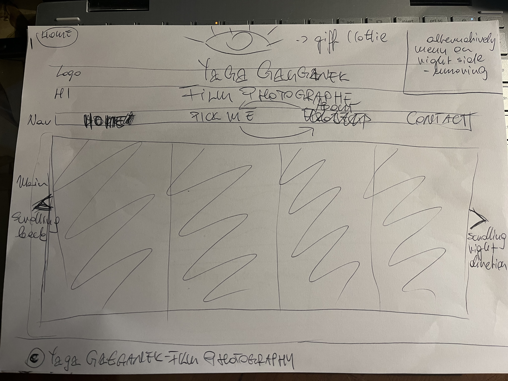
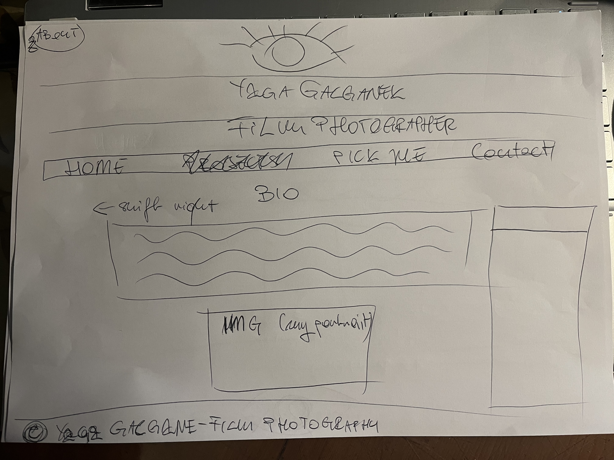

## User Story
**User Story:** As a photographer, I want to showcase my portfolio of photos on a website, so that potential clients can view and appreciate my work.

**Acceptance Criteria:**
*As a user*, I should be able to browse through different categories of photos.  
As a user, I should be able to view high-quality, visually appealing images that represent the photographer's skills.  
*As a user*, I should be able to access detailed information about each photo, such as the title, description, and technical details.  
*As a user*, I should be able to easily navigate between different sections of the portfolio, such as a homepage, gallery, about page, and contact page.  
*As a user*, I should have the option to contact the photographer for inquiries or booking requests.  
*As a user*, I should be able to view the portfolio website on various devices, including desktops, tablets, and mobile phones, with a responsive design that adjusts the layout accordingly.  
*As a user*, I could pick the most interesting photos and see results.
*As a photographer*, I should have the ability to update and manage the portfolio content easily, including adding new photos, editing existing photos, and organizing them into categories.  
*As a photographer*, I should be able to showcase my photography style and personal brand through the overall design and aesthetics of the website.  
**Note:** These acceptance criteria can be expanded and refined based on specific requirements and preferences of the photographer and their target audience.    
**Tageted audience:**
- other film/photographers
- potential clients  
- potential collaborators
- potential curators

## MPV  
### User stories - Priority  
1. As a user, I should be able to view high-quality, visually appealing images that represent the photographer's skills.  
2. *As a user*, I should be able to easily navigate between different sections of the portfolio, such as a homepage, gallery, about page, and contact page.  
3. *As a user*, I should have the option to contact the photographer for inquiries or booking requests.    
4. *As a user*, I should be able to view the portfolio website on various devices, including desktops, tablets, and mobile phones, with a responsive design that adjusts the layout accordingly.  
5. *As a user*, I could pick the most interesting photos and see results.
### User stories - Strech Goals
1. *As a photographer*, I should be able to showcase my photography style and personal brand through the overall design and aesthetics of the website.  
2. *As a user*, I should be able to browse through different categories of photos.  
3. 
4. 
5. *As a photographer*, I should have the ability to update and manage the portfolio content easily, including adding new photos, editing existing photos, and organizing them into categories.

### Project Domain/Data models
1. submit form
2. pick me - random pick/chart
3. local storage
4. additional - light and dark mode

### Wireframe
**Home**  
  

**About**  
  

**Pick Me - Voting + Chart**  
  

**Contact**  
  

